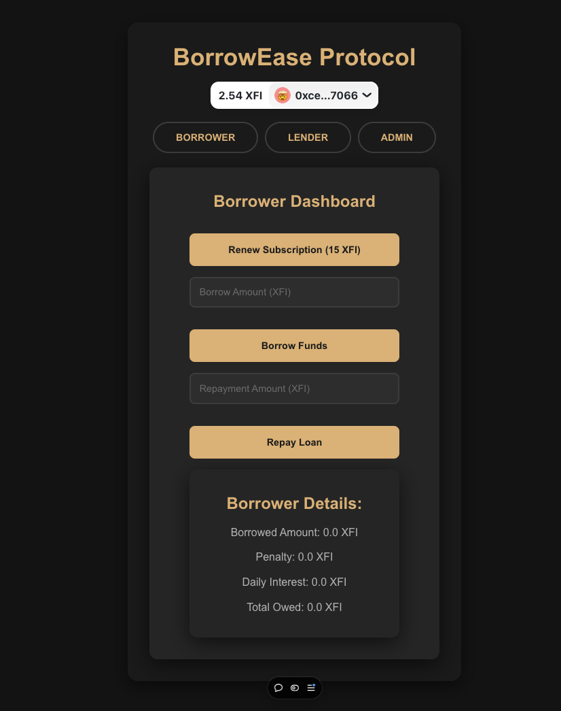

# BorrowEase Protocol

## Project Front Page

Here is a preview of the project's front page:



## Overview

The **Subscription-Based Lending** smart contract is designed to facilitate a decentralized lending and borrowing system with a subscription model. Users can borrow funds by subscribing to the platform for a fixed monthly fee, with grace periods, penalty fees, and interest rates applied to overdue payments. Lenders can deposit funds into the pool and earn monthly rewards based on the funds they've provided.

This contract combines subscription-based access with a traditional lending model, aiming to create a more structured and predictable system for both borrowers and lenders.

## Key Features

- **Subscription Model**: Borrowers must maintain an active subscription to borrow funds.
- **Fixed Borrowing Limit**: Borrowers are limited by a fixed borrowing amount, which cannot be exceeded.
- **Grace Period & Penalty**: Borrowers are given a grace period to repay loans, with penalties for late repayments.
- **Daily Interest**: Late repayments accrue daily interest.
- **Lender Rewards**: Lenders earn rewards based on the amount they have deposited and the interest accrued from borrower loans.
- **Loan Management**: Borrowers can manage their loans, repay borrowed amounts, and renew subscriptions.

## Problem Statement

Traditional lending systems often lack structure, leading to inconsistencies in repayment timelines, penalties, and reward distribution. This smart contract solves these issues by automating subscriptions, borrowing limits, interest rates, and lender rewards, ensuring a more predictable and efficient lending experience.

## Getting Started

### Prerequisites

- Basic understanding of Crossifi Chain and smart contract deployment.
- wallet (e.g., MetaMask).
- Solidity 0.8.0 or higher.

### Installation

1. Clone this repository to your local machine.
2. Compile and deploy the contract using [Remix IDE](https://remix.ethereum.org/) or any development environment that supports Solidity 0.8.0.
3. Ensure that your wallet is set up and connected to the network where the contract is deployed (e.g., Crossifi testnet.).

### Deployment

Deploy the smart contract on your preferred crossifi network and set the parameters such as the **subscription fee**, **grace period**, **penalty rate**, and **borrowing limit** according to your preferences.

```solidity
constructor(
    uint256 _subscriptionFee,
    uint256 _gracePeriod,
    uint256 _penaltyFeeRate,
    uint256 _fixedBorrowingLimit
)
```
## Interacting with the Contract

Once deployed, the contract can be interacted with through web3 or directly using a tool like Remix.

### Borrower Actions

- **Renew Subscription**: To continue borrowing, users must renew their subscriptions monthly by sending the required subscription fee.
- **Borrow Funds**: Borrowers can borrow funds up to the fixed borrowing limit as long as they are not blocked and their subscription is active.
- **Repay Funds**: Borrowers can repay their loan with interest, penalty, and any applicable fees.

### Lender Actions

- **Deposit Funds**: Lenders can deposit funds into the lending pool to earn rewards.
- **Withdraw Funds**: Lenders can withdraw their deposited funds from the lending pool.
- **Claim Rewards**: Lenders can claim monthly rewards based on their deposited funds.

### Owner Actions

- **Block/Unblock Borrowers**: The owner can block or unblock any borrower who violates the terms of the contract.
- **Adjust Borrowing Limits**: The owner can change the fixed borrowing limit at any time.

## Contract Functions

### Borrower Functions

- **renewSubscription()**: Renew the borrower's subscription by paying the monthly subscription fee.
- **borrow(uint256 amount)**: Borrow funds from the lending pool, respecting the fixed borrowing limit.
- **repay()**: Repay the borrowed amount with any penalties or interest that have accrued.

### Lender Functions

- **deposit()**: Deposit ETH into the lending pool to earn rewards.
- **withdraw(uint256 amount)**: Withdraw deposited funds from the lending pool.
- **claimRewards()**: Claim accumulated rewards for deposited funds.

### Owner Functions

- **blockBorrower(address borrower)**: Block a borrower from borrowing further funds.
- **unblockBorrower(address borrower)**: Unblock a borrower, allowing them to borrow again.
- **setFixedBorrowingLimit(uint256 limit)**: Set a new borrowing limit for all borrowers.
- **withdrawOwnerFunds()**: Withdraw any remaining funds in the contract balance to the owner's address.

## Future Development

This contract is designed to be extended and improved. Future developments include:

- **Customizable Subscription Fees**: Allowing borrowers to set their own subscription fees.
- **Interest Rate Adjustments**: Enabling the owner to adjust interest rates based on market conditions.
- **Penalty Fee Adjustments**: Allowing more flexible penalty fee structures for different borrower scenarios.
- **Cross-Chain Support**: Expanding the system to support cross-chain lending and borrowing.

## Contributing

Contributions are welcome! If you'd like to contribute to this project, please fork the repository, make your changes, and submit a pull request.

## License

This project is licensed under the MIT License. See the LICENSE file for details.

## Support

For any inquiries or support, please open an issue on the GitHub repository or contact us via email.

## Links

- **GitHub Repository**: [https://github.com/Anish99594/BorrowEase.git](#)
- **Demo Video**: [Watch here](#)
- **Project Website**: [https://borrow-ease.vercel.app/](#)

